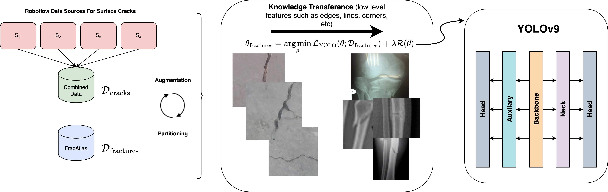
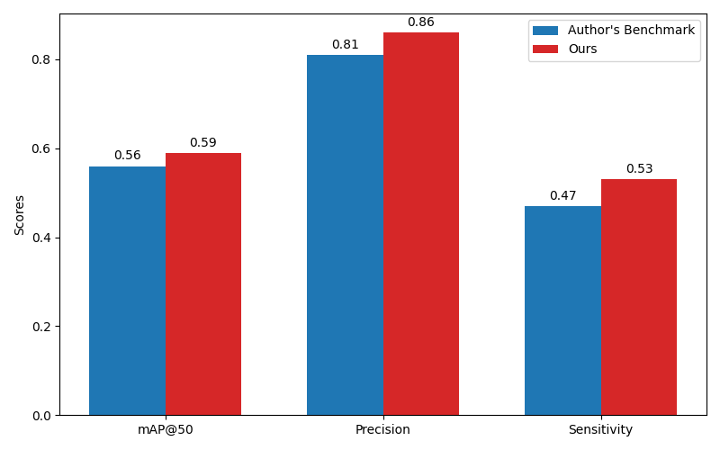

# Small Data, Big Impact: A Multi-Locale Bone Fracture Localization on an Extremely Limited Dataset Via Crack-Informed YOLOv9 Variants

> [Small Data, Big Impact: A Multi-Locale Bone Fracture Localization on an Extremely Limited Dataset Via Crack-Informed YOLOv9 Variants](https://www.researchgate.net/publication/388135557_Small_Data_Big_Impact_A_Multi-Locale_Bone_Fracture_Detection_on_an_Extremely_Limited_Dataset_Via_Crack-Informed_YOLOv9_Variants)


## Abstract

Automated wrist fracture recognition has become a crucial research area due to the challenge of accurate X-ray interpretation in clinical settings without specialized expertise. With the development of neural networks, YOLO models have
been extensively applied to fracture detection as computer assisted diagnoses (CAD). However, detection models can struggle when trained on extremely small datasets, which is often the case in medical scenarios. In this study, we utilize an extremely limited fracture dataset and hypothesize that the
structural similarities between surface cracks and bone fractures can allow YOLOv9 to transfer knowledge effectively. We show that pre-training YOLOv9 on surface cracks rather than on COCO is how YOLO models are typically pre-trained, and fine-tuning it on the fracture dataset yields substantial performance improvements. We also show that knowledge gained from the surface cracks, requires fewer epochs to converge and minimizes overfitting. We achieved state-of-the-art (SOTA) performance on the recent FracAtlas dataset, surpassing the previously established benchmark. Our approach improved the mean average precision (mAP) score by 3%, precision by 5%, and sensitivity by 6%. The implementation code is publicly available at [URL.](https://github.com/ammarlodhi255/Crack-Informed-YOLOv9-For-Multi-Locale-Fracture-Detection)

### YOLOv9 architecture

<p align="center">
  
</p>

## Citation

If you find our paper useful in your research, please consider citing:

    @article{
    }

## Requirements

- Linux (Ubuntu)
- Python = 3.9
- Pytorch = 1.13.1
- NVIDIA GPU + CUDA CuDNN

## Environment

```
  pip install -r requirements.txt
```

## Dataset

### Dataset Split

- FracAtlas Dataset [(Download Link)](https://www.nature.com/articles/s41597-023-02432-4)
- Download dataset and put images and annotatation into `./FracAtlas/data/Split_Authors/images`, `./FracAtlas/data/Split_Authors/labels`.
  ```
    python split.py
  ```
- The dataset is divided into training, validation, and testing set (70-20-10 %) according to the key `patient_id` stored in `dataset.csv`.
- The script then will move the files into the relative folder as it is represented here below.

       FracAtlas
          └── data
            └── Split_Authors
               ├── meta.yaml
               ├── images
               │    ├── train
               │    │    ├── train_img1.png
               │    │    └── ...
               │    ├── valid
               │    │    ├── valid_img1.png
               │    │    └── ...
               │    └── test
               │         ├── test_img1.png
               │         └── ...
               └── labels
                    ├── train
                    │    ├── train_annotation1.txt
                    │    └── ...
                    ├── valid
                    │    ├── valid_annotation1.txt
                    │    └── ...
                    └── test
                         ├── test_annotation1.txt
                         └── ...

The script will create 3 files: `train_data.csv`, `valid_data.csv`, and `test_data.csv` with the same structure of `dataset.csv`.

### Data Augmentation

- Data augmentation of the training set using the addWeighted function doubles the size of the training set.

```
  python imgaug.py --input_img /path/to/input/train/ --output_img /path/to/output/train/ --input_label /path/to/input/labels/ --output_label /path/to/output/labels/
```

For example:

```
  python imgaug.py --input_img ./GRAZPEDWRI-DX/data/images/train/ --output_img ./GRAZPEDWRI-DX/data/images/train_aug/ --input_label ./GRAZPEDWRI-DX/data/labels/train/ --output_label ./GRAZPEDWRI-DX/data/labels/train_aug/
```

- The path of the processed file is shown below:

       GRAZPEDWRI-DX_dataset
          └── data
               ├── meta.yaml
               ├── images
               │    ├── train
               │    │    ├── train_img1.png
               │    │    └── ...
               │    ├── train_aug
               │    │    ├── train_aug_img1.png
               │    │    └── ...
               │    ├── valid
               │    │    ├── valid_img1.png
               │    │    └── ...
               │    └── test
               │         ├── test_img1.png
               │         └── ...
               └── labels
                    ├── train
                    │    ├── train_annotation1.txt
                    │    └── ...
                    ├── train_aug
                    │    ├── train_aug_annotation1.txt
                    │    └── ...
                    ├── valid
                    │    ├── valid_annotation1.txt
                    │    └── ...
                    └── test
                         ├── test_annotation1.txt
                         └── ...


## Model

You can get the open source code of YOLOv9 through [YOLOv9 official GitHub](https://github.com/WongKinYiu/yolov9.git).

### Train

Before training the model, make sure the path to the data in the `meta.yaml` file is correct.

- meta.yaml

```
  # patch: /path/to/GRAZPEDWRI-DX/data
  path: 'E:/GRAZPEDWRI-DX/data'
  train: 'images/train_aug'
  val: 'images/valid'
  test: 'images/test'
```

- Arguments

|     Key      | Value  |                                         Description                                          |
| :----------: | :----: | :------------------------------------------------------------------------------------------: |
|    model     |  None  |                      path to model file, i.e. yolov9n.pt, yolov9n.yaml                       |
|     data     |  None  |                             path to data file, i.e. coco128.yaml                             |
|    epochs    |  100   |                                number of epochs to train for                                 |
|   patience   |   50   |         epochs to wait for no observable improvement for early stopping of training          |
|    batch     |   16   |                        number of images per batch (-1 for AutoBatch)                         |
|    imgsz     |  640   |                       size of input images as integer, i.e. 640, 1024                        |
|     save     |  True  |                          save train checkpoints and predict results                          |
|    device    |  None  |             device to run on, i.e. cuda device=0 or device=0,1,2,3 or device=cpu             |
|   workers    |   8    |                 number of worker threads for data loading (per RANK if DDP)                  |
|  pretrained  |  True  | (bool or str) whether to use a pretrained model (bool) or a model to load weights from (str) |
|  optimizer   | 'auto' |       optimizer to use, choices=SGD, Adam, Adamax, AdamW, NAdam, RAdam, RMSProp, auto        |
|    resume    | False  |                             resume training from last checkpoint                             |
|     lr0      |  0.01  |                       initial learning rate (i.e. SGD=1E-2, Adam=1E-3)                       |
|   momentum   | 0.937  |                                   SGD momentum/Adam beta1                                    |
| weight_decay | 0.0005 |                                 optimizer weight decay 5e-4                                  |
|     val      |  True  |                                validate/test during training                                 |

- Example

```
  cd Bone_Fracture_Detection_YOLOv9
  yolo train model=yolov9n.pt data=./GRAZPEDWRI-DX/data/meta.yaml epochs=100 batch=16 imgsz=640 save=True device=0 workers=4 pretrained=yolov9n.pt optimizer=SGD lr0=0.01
```

### Trained Model (Weights)

To download the trained model weights with this link [Crack-Informed-YOLOv9-E-Weights.](https://figshare.com/s/153a57f11c1e38933cc4)

### Validate

- Arguments

|     Key     | Value |                           Description                           |
| :---------: | :---: | :-------------------------------------------------------------: |
|    data     | None  |              path to data file, i.e. coco128.yaml               |
|    imgsz    |  640  |         size of input images as integer, i.e. 640, 1024         |
|    batch    |  16   |          number of images per batch (-1 for AutoBatch)          |
|  save_json  | False |                    save results to JSON file                    |
| save_hybrid | False | save hybrid version of labels (labels + additional predictions) |
|    conf     | 0.001 |            object confidence threshold for detection            |
|     iou     |  0.6  |         intersection over union (IoU) threshold for NMS         |

- CLI

```
  yolo val model=/path/to/best.pt data=/path/to/meta.yaml
```

## Experimental Results

* Performance comparison of variants with and without pre-training on surface cracks.

| Variant  | Default YOLOv9                      |                                     | Crack-Informed YOLOv9                |                                     |
|----------|-------------------------------------|-------------------------------------|-------------------------------------|-------------------------------------|
|          | Test mAP@50 | Val mAP@50 | Convergence Ep | Train Time | Test mAP@50 | Val mAP@50 | Convergence Ep | Train Time |
| M        | 0.38        | 0.44       | 320            | 5.68h      | 0.49        | 0.57       | 123            | 1.89h      |
| C        | 0.52        | 0.53       | 174            | 2.60h      | 0.53        | 0.58       | 108            | 1.99h      |
| E        | 0.45        | 0.47       | 174            | 2.69h      | 0.60        | 0.59       | 84             | 1.32h      |
| GELAN    | 0.43        | 0.52       | 150            | 3.23h      | 0.54        | 0.61       | 174            | 2.22h      |
| GELAN-C  | 0.37        | 0.60       | 174            | 3.24h      | 0.49        | 0.61       | 151            | 1.65h      |
| GELAN-E  | 0.50        | 0.59       | 262            | 3.59h      | 0.51        | 0.63       | 177            | 2.10h      |
----------------

* Evaluation of a single variant YOLOv9-E using different methods.

| # of Training Instances | Method                            | Test mAP@50 | Val mAP@50 | Test Precision | Test Sensitivity |
|-------------------------|-----------------------------------|-------------|------------|----------------|------------------|
| 574                     | Default                           | 0.45        | 0.47       | 0.64           | 0.50             |
| 574                     | **Crack-Informed (Ours)**         | **0.60**    | **0.59**   | **0.89**       | **0.51**         |
| 574                     | Pre-trained on COCO               | 0.45        | 0.54       | 0.61           | 0.44             |
| 1148                    | Brightness + Contrast Augmentation [3] | 0.47        | 0.49       | 0.61           | 0.45             |
| 5740                    | Albumentations Augmentation       | 0.25        | 0.37       | 0.45           | 0.30             |


<p align="center">
  
</p>

### Fracture Detection Using YOLOv9

<p align="center">
  
</p>
